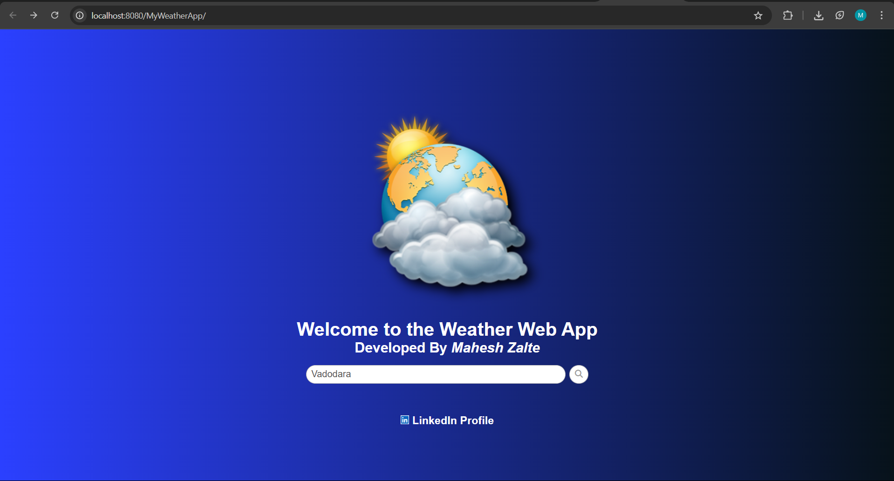
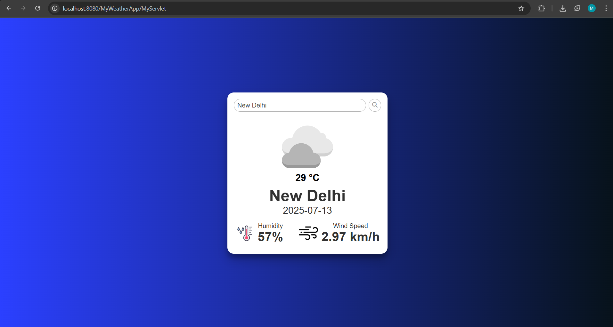

# 🌦️ MyWeatherApp

A Java-based web application that fetches and displays real-time weather information using the **OpenWeatherMap API**. Built with **Servlets, JSP, HTML, CSS, and JavaScript**.

---

## 🚀 Features

- 🔍 Search weather by city name
- ☁️ Real-time weather information (temperature, condition, wind, humidity)
- 🖥️ Clean, responsive user interface using JSP + CSS
- 🌐 Integration with OpenWeatherMap API
- 📦 Maven-based project for easy packaging
- 🐳 Docker support for seamless deployment
- 🧑‍💻 Servlet + JSP backend logic

---

## 🖼️ Screenshots

### 🔸 Home Page


### 🔸 Weather Result Page


---

## 🛠️ Tech Stack

- **Java 8/22**
- **JSP & Servlets**
- **HTML / CSS / JavaScript**
- **Apache Tomcat**
- **OpenWeatherMap API**

---

## 🧪 How to Run Locally

### Prerequisites:
- Java JDK
- Apache Maven
- Apache Tomcat
- Internet connection (for API calls)

### Steps:

```bash
# Clone the project
git clone https://github.com/maheshzalte/MyWeatherApp.git
cd MyWeatherApp

# Build the project
mvn clean package

# Move the generated WAR file to Tomcat's webapps
cp target/MyWeatherApp.war /path/to/tomcat/webapps/

# Start Tomcat
/path/to/tomcat/bin/startup.sh

# Access on browser
http://localhost:8080/MyWeatherApp
